# Sequence Diagrams - Wattar Academy Management System

## 1. Manager - Add New Student

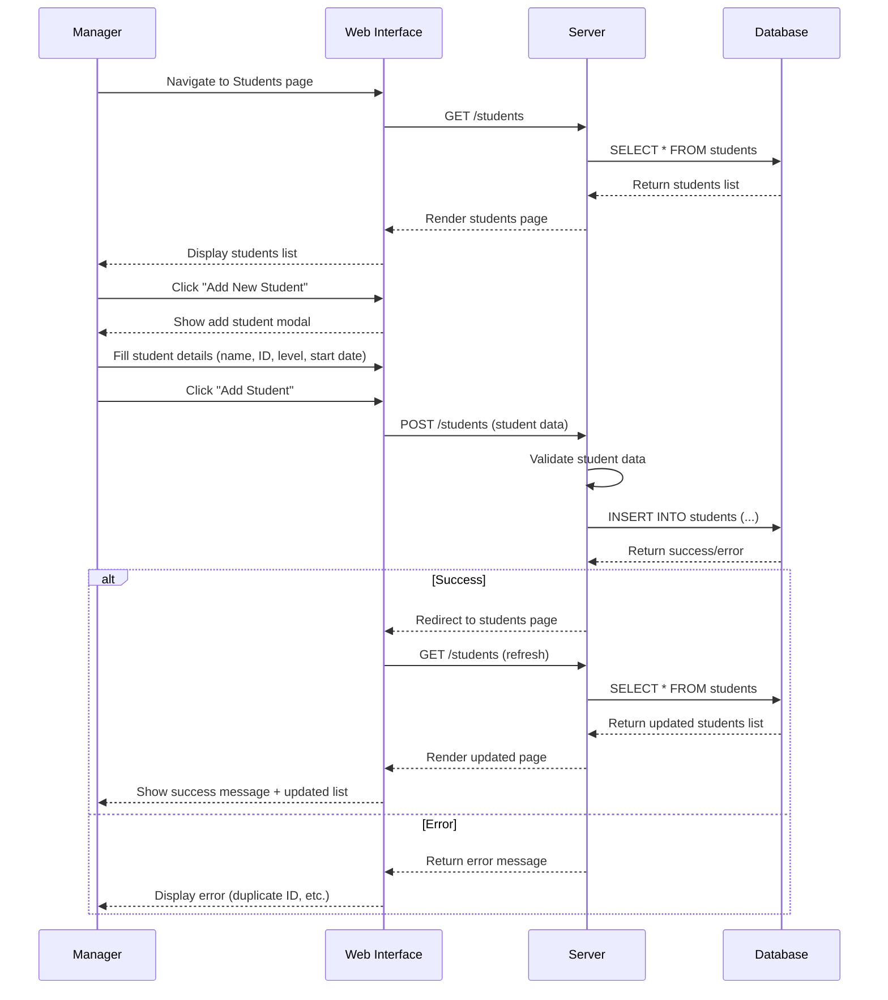
```mermaid
sequenceDiagram
    participant M as Manager
    participant UI as Web Interface
    participant S as Server
    participant DB as Database
    
    M->>UI: Navigate to Students page
    UI->>S: GET /students
    S->>DB: SELECT * FROM students
    DB-->>S: Return students list
    S-->>UI: Render students page
    UI-->>M: Display students list
    
    M->>UI: Click "Add New Student"
    UI-->>M: Show add student modal
    
    M->>UI: Fill student details (name, ID, level, start date)
    M->>UI: Click "Add Student"
    UI->>S: POST /students (student data)
    
    S->>S: Validate student data
    S->>DB: INSERT INTO students (...)
    DB-->>S: Return success/error
    
    alt Success
        S-->>UI: Redirect to students page
        UI->>S: GET /students (refresh)
        S->>DB: SELECT * FROM students
        DB-->>S: Return updated students list
        S-->>UI: Render updated page
        UI-->>M: Show success message + updated list
    else Error
        S-->>UI: Return error message
        UI-->>M: Display error (duplicate ID, etc.)
    end
```

## 2. Trainer - Mark Class Attendance

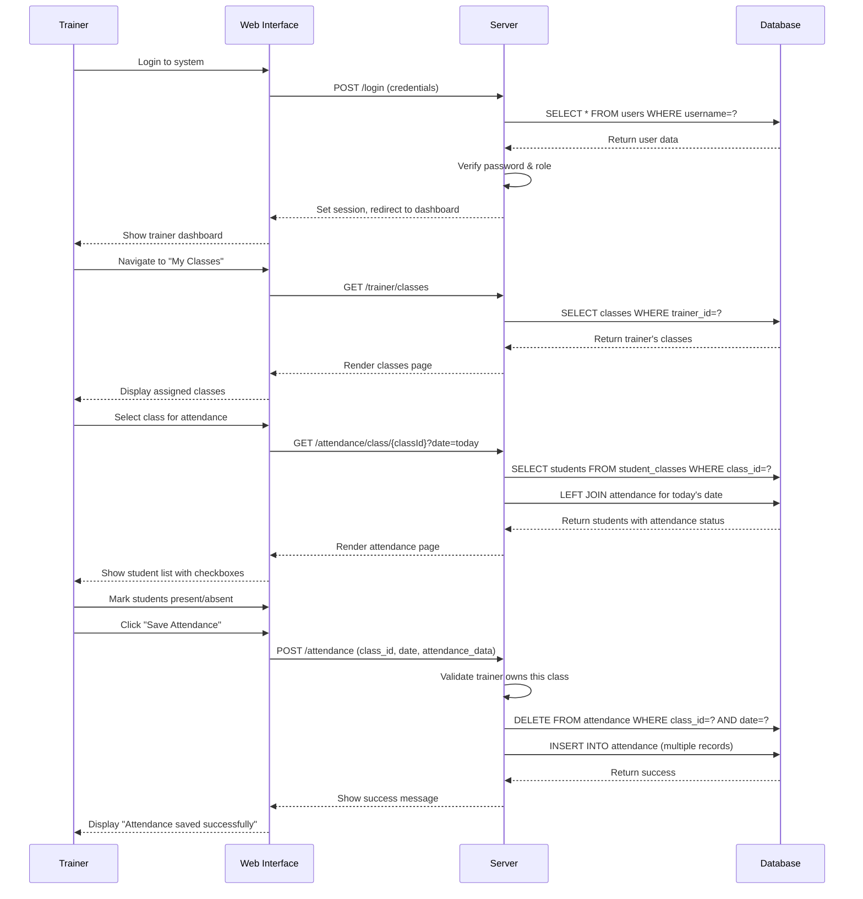
```mermaid
sequenceDiagram
    participant T as Trainer
    participant UI as Web Interface
    participant S as Server
    participant DB as Database
    
    T->>UI: Login to system
    UI->>S: POST /login (credentials)
    S->>DB: SELECT * FROM users WHERE username=?
    DB-->>S: Return user data
    S->>S: Verify password & role
    S-->>UI: Set session, redirect to dashboard
    UI-->>T: Show trainer dashboard
    
    T->>UI: Navigate to "My Classes"
    UI->>S: GET /trainer/classes
    S->>DB: SELECT classes WHERE trainer_id=?
    DB-->>S: Return trainer's classes
    S-->>UI: Render classes page
    UI-->>T: Display assigned classes
    
    T->>UI: Select class for attendance
    UI->>S: GET /attendance/class/{classId}?date=today
    S->>DB: SELECT students FROM student_classes WHERE class_id=?
    S->>DB: LEFT JOIN attendance for today's date
    DB-->>S: Return students with attendance status
    S-->>UI: Render attendance page
    UI-->>T: Show student list with checkboxes
    
    T->>UI: Mark students present/absent
    T->>UI: Click "Save Attendance"
    UI->>S: POST /attendance (class_id, date, attendance_data)
    
    S->>S: Validate trainer owns this class
    S->>DB: DELETE FROM attendance WHERE class_id=? AND date=?
    S->>DB: INSERT INTO attendance (multiple records)
    DB-->>S: Return success
    
    S-->>UI: Show success message
    UI-->>T: Display "Attendance saved successfully"
```

## 3. Reception - Record Student Payment

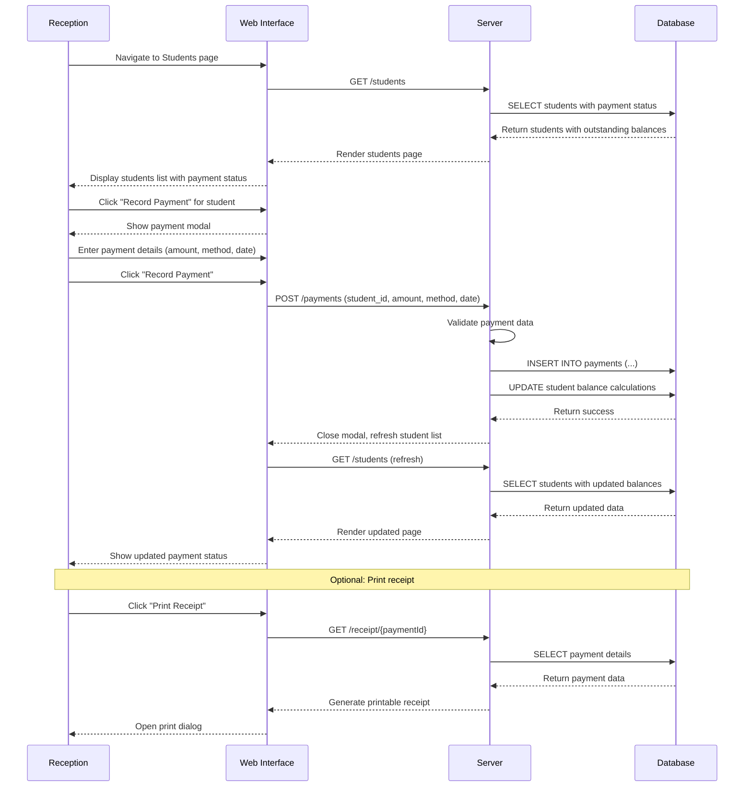
```mermaid
sequenceDiagram
    participant R as Reception
    participant UI as Web Interface
    participant S as Server
    participant DB as Database
    
    R->>UI: Navigate to Students page
    UI->>S: GET /students
    S->>DB: SELECT students with payment status
    DB-->>S: Return students with outstanding balances
    S-->>UI: Render students page
    UI-->>R: Display students list with payment status
    
    R->>UI: Click "Record Payment" for student
    UI-->>R: Show payment modal
    
    R->>UI: Enter payment details (amount, method, date)
    R->>UI: Click "Record Payment"
    UI->>S: POST /payments (student_id, amount, method, date)
    
    S->>S: Validate payment data
    S->>DB: INSERT INTO payments (...)
    S->>DB: UPDATE student balance calculations
    DB-->>S: Return success
    
    S-->>UI: Close modal, refresh student list
    UI->>S: GET /students (refresh)
    S->>DB: SELECT students with updated balances
    DB-->>S: Return updated data
    S-->>UI: Render updated page
    UI-->>R: Show updated payment status
    
    Note over R,DB: Optional: Print receipt
    R->>UI: Click "Print Receipt"
    UI->>S: GET /receipt/{paymentId}
    S->>DB: SELECT payment details
    DB-->>S: Return payment data
    S-->>UI: Generate printable receipt
    UI-->>R: Open print dialog
```

## 4. Manager - View Academy Statistics

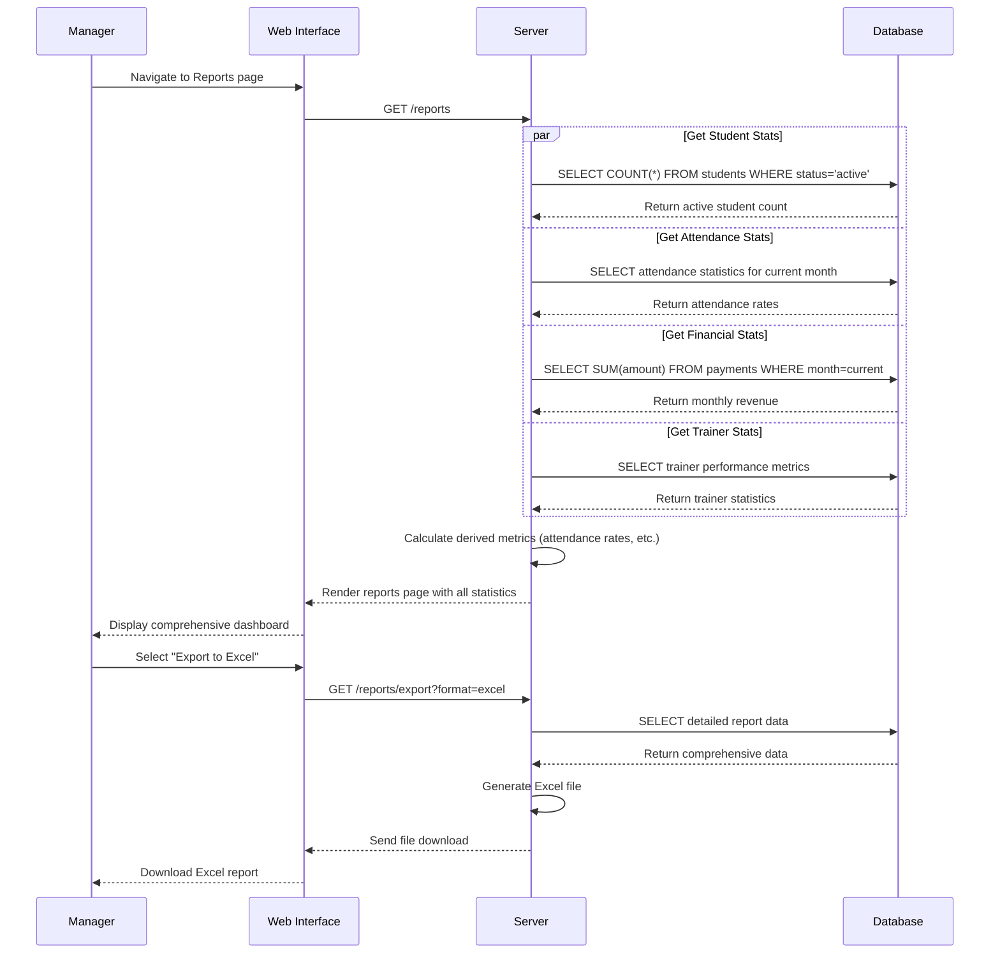
```mermaid
sequenceDiagram
    participant M as Manager
    participant UI as Web Interface
    participant S as Server
    participant DB as Database
    
    M->>UI: Navigate to Reports page
    UI->>S: GET /reports
    
    par Get Student Stats
        S->>DB: SELECT COUNT(*) FROM students WHERE status='active'
        DB-->>S: Return active student count
    and Get Attendance Stats
        S->>DB: SELECT attendance statistics for current month
        DB-->>S: Return attendance rates
    and Get Financial Stats
        S->>DB: SELECT SUM(amount) FROM payments WHERE month=current
        DB-->>S: Return monthly revenue
    and Get Trainer Stats
        S->>DB: SELECT trainer performance metrics
        DB-->>S: Return trainer statistics
    end
    
    S->>S: Calculate derived metrics (attendance rates, etc.)
    S-->>UI: Render reports page with all statistics
    UI-->>M: Display comprehensive dashboard
    
    M->>UI: Select "Export to Excel"
    UI->>S: GET /reports/export?format=excel
    S->>DB: SELECT detailed report data
    DB-->>S: Return comprehensive data
    S->>S: Generate Excel file
    S-->>UI: Send file download
    UI-->>M: Download Excel report
```

## 5. Trainer - Add Student Progress Note

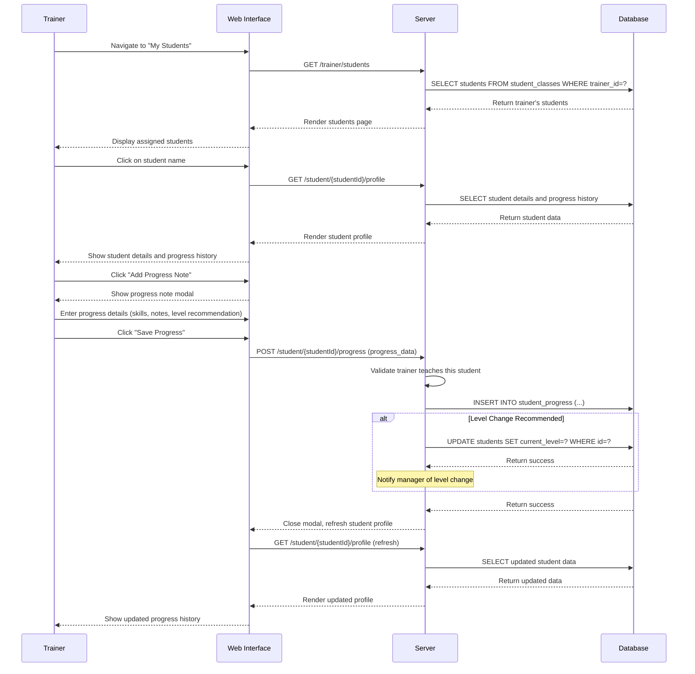
```mermaid
sequenceDiagram
    participant T as Trainer
    participant UI as Web Interface
    participant S as Server
    participant DB as Database
    
    T->>UI: Navigate to "My Students"
    UI->>S: GET /trainer/students
    S->>DB: SELECT students FROM student_classes WHERE trainer_id=?
    DB-->>S: Return trainer's students
    S-->>UI: Render students page
    UI-->>T: Display assigned students
    
    T->>UI: Click on student name
    UI->>S: GET /student/{studentId}/profile
    S->>DB: SELECT student details and progress history
    DB-->>S: Return student data
    S-->>UI: Render student profile
    UI-->>T: Show student details and progress history
    
    T->>UI: Click "Add Progress Note"
    UI-->>T: Show progress note modal
    
    T->>UI: Enter progress details (skills, notes, level recommendation)
    T->>UI: Click "Save Progress"
    UI->>S: POST /student/{studentId}/progress (progress_data)
    
    S->>S: Validate trainer teaches this student
    S->>DB: INSERT INTO student_progress (...)
    
    alt Level Change Recommended
        S->>DB: UPDATE students SET current_level=? WHERE id=?
        DB-->>S: Return success
        Note over S: Notify manager of level change
    end
    
    DB-->>S: Return success
    S-->>UI: Close modal, refresh student profile
    UI->>S: GET /student/{studentId}/profile (refresh)
    S->>DB: SELECT updated student data
    DB-->>S: Return updated data
    S-->>UI: Render updated profile
    UI-->>T: Show updated progress history
```

## 6. Reception - Register New Student

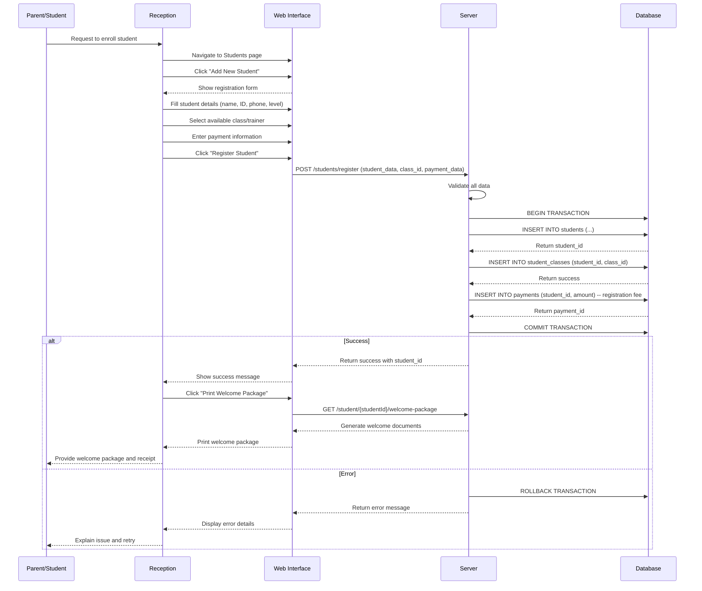
```mermaid
sequenceDiagram
    participant P as Parent/Student
    participant R as Reception
    participant UI as Web Interface
    participant S as Server
    participant DB as Database
    
    P->>R: Request to enroll student
    R->>UI: Navigate to Students page
    R->>UI: Click "Add New Student"
    UI-->>R: Show registration form
    
    R->>UI: Fill student details (name, ID, phone, level)
    R->>UI: Select available class/trainer
    R->>UI: Enter payment information
    R->>UI: Click "Register Student"
    
    UI->>S: POST /students/register (student_data, class_id, payment_data)
    
    S->>S: Validate all data
    S->>DB: BEGIN TRANSACTION
    
    S->>DB: INSERT INTO students (...)
    DB-->>S: Return student_id
    
    S->>DB: INSERT INTO student_classes (student_id, class_id)
    DB-->>S: Return success
    
    S->>DB: INSERT INTO payments (student_id, amount) -- registration fee
    DB-->>S: Return payment_id
    
    S->>DB: COMMIT TRANSACTION
    
    alt Success
        S-->>UI: Return success with student_id
        UI-->>R: Show success message
        R->>UI: Click "Print Welcome Package"
        UI->>S: GET /student/{studentId}/welcome-package
        S-->>UI: Generate welcome documents
        UI-->>R: Print welcome package
        R-->>P: Provide welcome package and receipt
    else Error
        S->>DB: ROLLBACK TRANSACTION
        S-->>UI: Return error message
        UI-->>R: Display error details
        R-->>P: Explain issue and retry
    end
```

## 7. Manager - Assign Student to Trainer

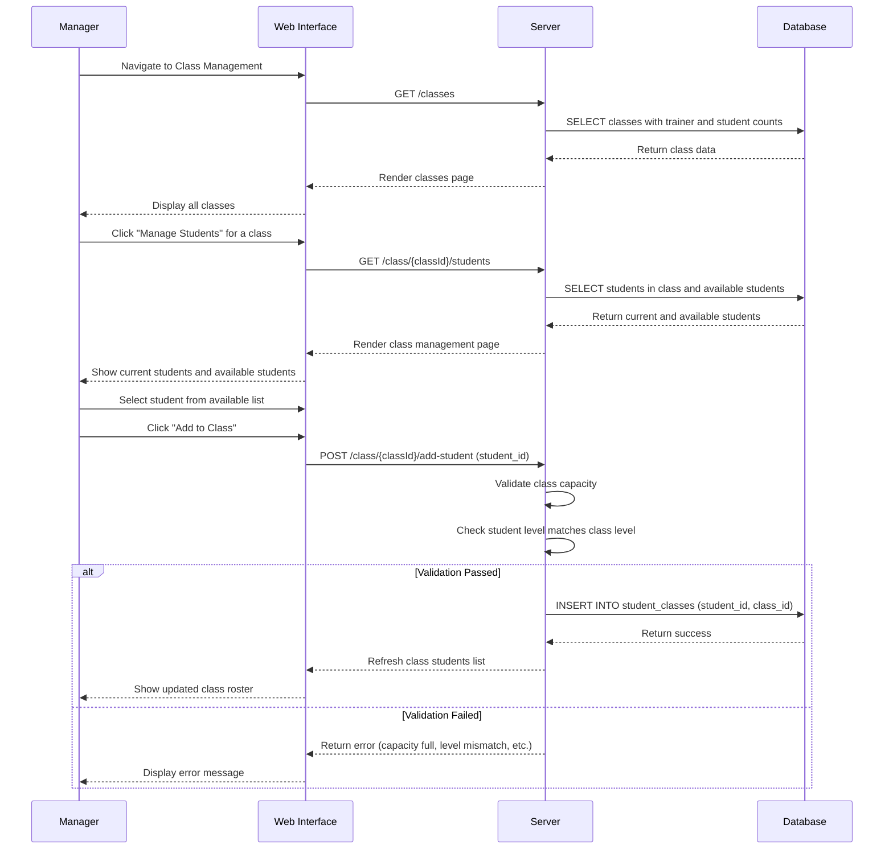
```mermaid
sequenceDiagram
    participant M as Manager
    participant UI as Web Interface
    participant S as Server
    participant DB as Database
    
    M->>UI: Navigate to Class Management
    UI->>S: GET /classes
    S->>DB: SELECT classes with trainer and student counts
    DB-->>S: Return class data
    S-->>UI: Render classes page
    UI-->>M: Display all classes
    
    M->>UI: Click "Manage Students" for a class
    UI->>S: GET /class/{classId}/students
    S->>DB: SELECT students in class and available students
    DB-->>S: Return current and available students
    S-->>UI: Render class management page
    UI-->>M: Show current students and available students
    
    M->>UI: Select student from available list
    M->>UI: Click "Add to Class"
    UI->>S: POST /class/{classId}/add-student (student_id)
    
    S->>S: Validate class capacity
    S->>S: Check student level matches class level
    
    alt Validation Passed
        S->>DB: INSERT INTO student_classes (student_id, class_id)
        DB-->>S: Return success
        S-->>UI: Refresh class students list
        UI-->>M: Show updated class roster
    else Validation Failed
        S-->>UI: Return error (capacity full, level mismatch, etc.)
        UI-->>M: Display error message
    end
```

## 8. Manager - View Trainer Performance

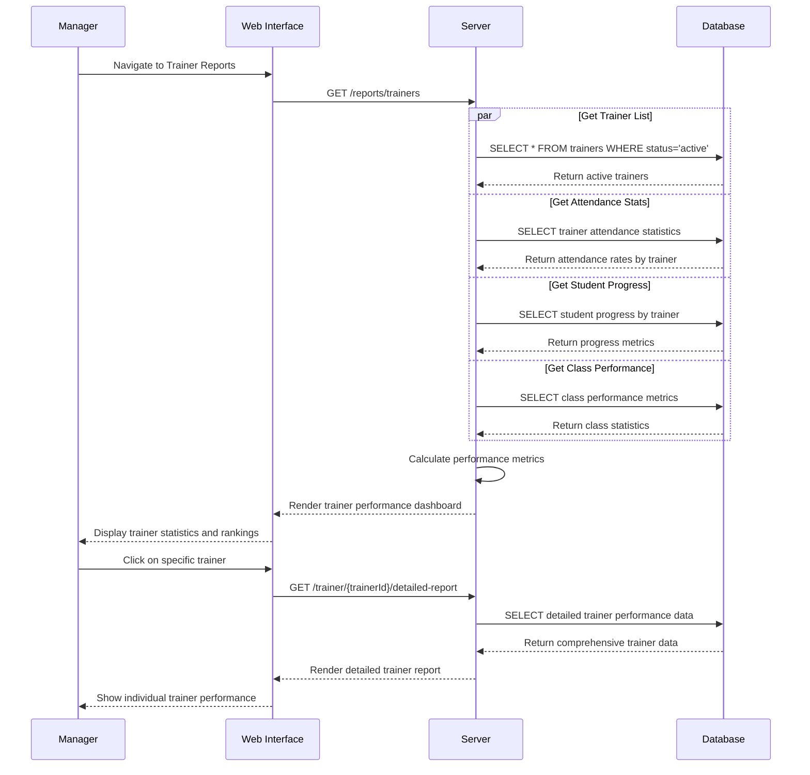
```mermaid
sequenceDiagram
    participant M as Manager
    participant UI as Web Interface
    participant S as Server
    participant DB as Database
    
    M->>UI: Navigate to Trainer Reports
    UI->>S: GET /reports/trainers
    
    par Get Trainer List
        S->>DB: SELECT * FROM trainers WHERE status='active'
        DB-->>S: Return active trainers
    and Get Attendance Stats
        S->>DB: SELECT trainer attendance statistics
        DB-->>S: Return attendance rates by trainer
    and Get Student Progress
        S->>DB: SELECT student progress by trainer
        DB-->>S: Return progress metrics
    and Get Class Performance
        S->>DB: SELECT class performance metrics
        DB-->>S: Return class statistics
    end
    
    S->>S: Calculate performance metrics
    S-->>UI: Render trainer performance dashboard
    UI-->>M: Display trainer statistics and rankings
    
    M->>UI: Click on specific trainer
    UI->>S: GET /trainer/{trainerId}/detailed-report
    S->>DB: SELECT detailed trainer performance data
    DB-->>S: Return comprehensive trainer data
    S-->>UI: Render detailed trainer report
    UI-->>M: Show individual trainer performance
```

## 9. Reception - Handle Outstanding Payments

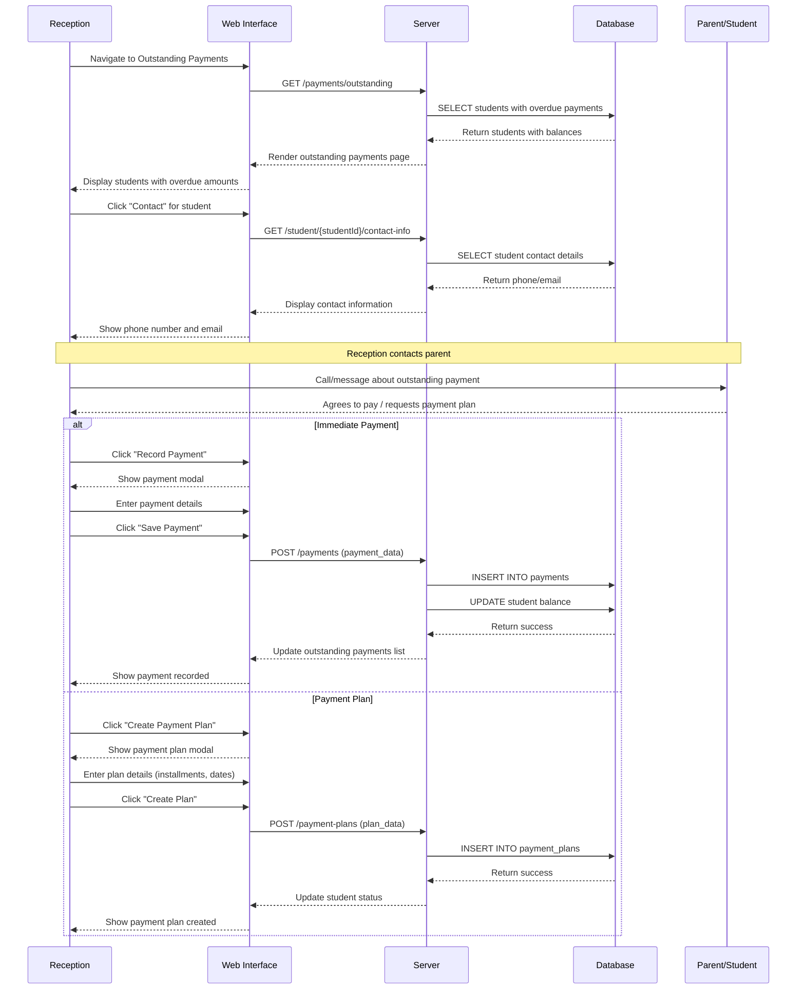
```mermaid
sequenceDiagram
    participant R as Reception
    participant UI as Web Interface
    participant S as Server
    participant DB as Database
    participant P as Parent/Student
    
    R->>UI: Navigate to Outstanding Payments
    UI->>S: GET /payments/outstanding
    S->>DB: SELECT students with overdue payments
    DB-->>S: Return students with balances
    S-->>UI: Render outstanding payments page
    UI-->>R: Display students with overdue amounts
    
    R->>UI: Click "Contact" for student
    UI->>S: GET /student/{studentId}/contact-info
    S->>DB: SELECT student contact details
    DB-->>S: Return phone/email
    S-->>UI: Display contact information
    UI-->>R: Show phone number and email
    
    Note over R,P: Reception contacts parent
    R->>P: Call/message about outstanding payment
    P-->>R: Agrees to pay / requests payment plan
    
    alt Immediate Payment
        R->>UI: Click "Record Payment"
        UI-->>R: Show payment modal
        R->>UI: Enter payment details
        R->>UI: Click "Save Payment"
        UI->>S: POST /payments (payment_data)
        S->>DB: INSERT INTO payments
        S->>DB: UPDATE student balance
        DB-->>S: Return success
        S-->>UI: Update outstanding payments list
        UI-->>R: Show payment recorded
    else Payment Plan
        R->>UI: Click "Create Payment Plan"
        UI-->>R: Show payment plan modal
        R->>UI: Enter plan details (installments, dates)
        R->>UI: Click "Create Plan"
        UI->>S: POST /payment-plans (plan_data)
        S->>DB: INSERT INTO payment_plans
        DB-->>S: Return success
        S-->>UI: Update student status
        UI-->>R: Show payment plan created
    end
```

## 10. Trainer - View Class Schedule

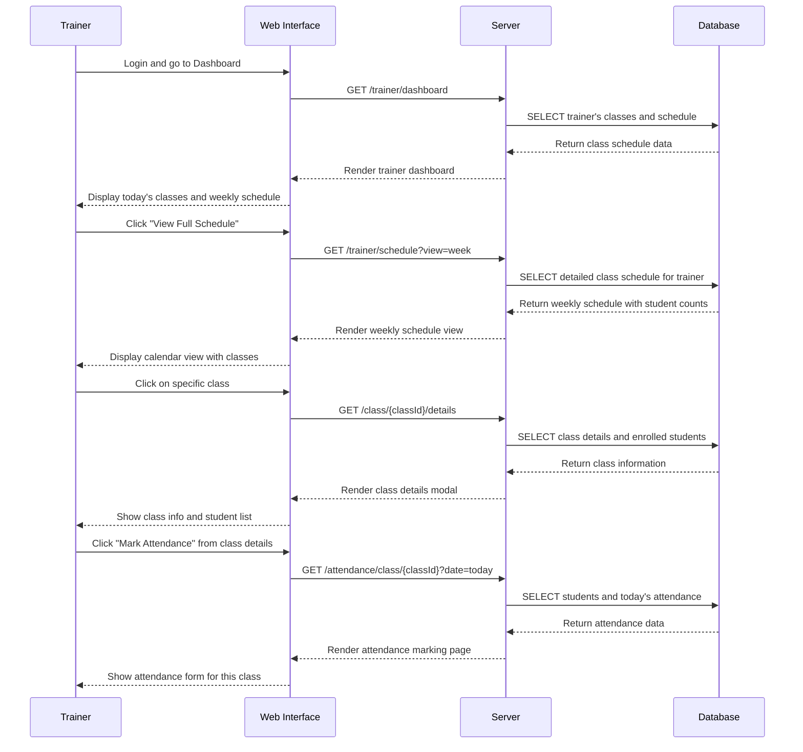
```mermaid
sequenceDiagram
    participant T as Trainer
    participant UI as Web Interface
    participant S as Server
    participant DB as Database
    
    T->>UI: Login and go to Dashboard
    UI->>S: GET /trainer/dashboard
    S->>DB: SELECT trainer's classes and schedule
    DB-->>S: Return class schedule data
    S-->>UI: Render trainer dashboard
    UI-->>T: Display today's classes and weekly schedule
    
    T->>UI: Click "View Full Schedule"
    UI->>S: GET /trainer/schedule?view=week
    S->>DB: SELECT detailed class schedule for trainer
    DB-->>S: Return weekly schedule with student counts
    S-->>UI: Render weekly schedule view
    UI-->>T: Display calendar view with classes
    
    T->>UI: Click on specific class
    UI->>S: GET /class/{classId}/details
    S->>DB: SELECT class details and enrolled students
    DB-->>S: Return class information
    S-->>UI: Render class details modal
    UI-->>T: Show class info and student list
    
    T->>UI: Click "Mark Attendance" from class details
    UI->>S: GET /attendance/class/{classId}?date=today
    S->>DB: SELECT students and today's attendance
    DB-->>S: Return attendance data
    S-->>UI: Render attendance marking page
    UI-->>T: Show attendance form for this class
```

## 11. Manager - Generate Monthly Report

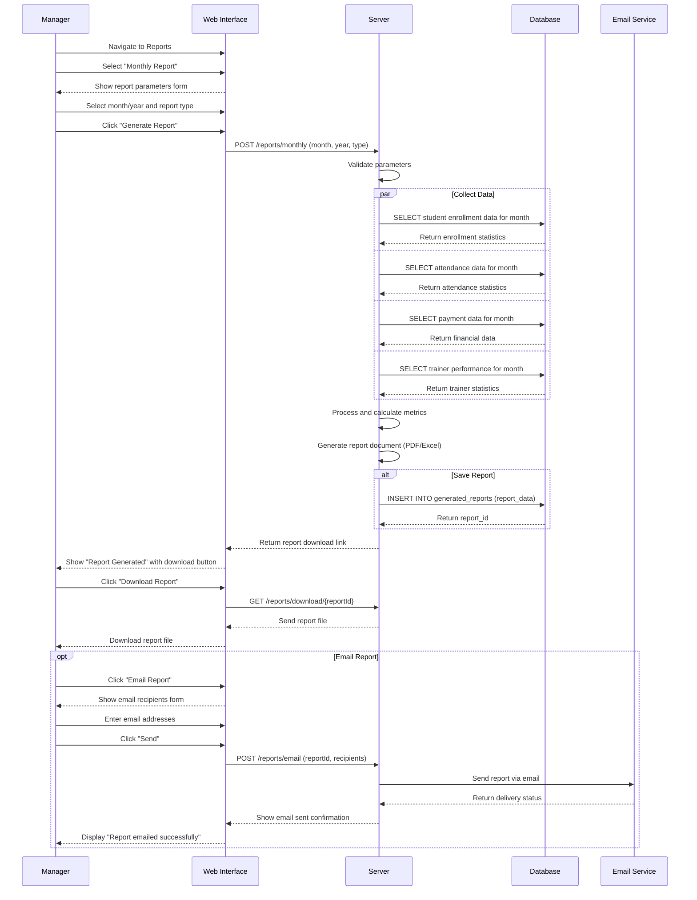
```mermaid
sequenceDiagram
    participant M as Manager
    participant UI as Web Interface
    participant S as Server
    participant DB as Database
    participant Email as Email Service
    
    M->>UI: Navigate to Reports
    M->>UI: Select "Monthly Report"
    UI-->>M: Show report parameters form
    
    M->>UI: Select month/year and report type
    M->>UI: Click "Generate Report"
    UI->>S: POST /reports/monthly (month, year, type)
    
    S->>S: Validate parameters
    
    par Collect Data
        S->>DB: SELECT student enrollment data for month
        DB-->>S: Return enrollment statistics
    and
        S->>DB: SELECT attendance data for month
        DB-->>S: Return attendance statistics
    and
        S->>DB: SELECT payment data for month
        DB-->>S: Return financial data
    and
        S->>DB: SELECT trainer performance for month
        DB-->>S: Return trainer statistics
    end
    
    S->>S: Process and calculate metrics
    S->>S: Generate report document (PDF/Excel)
    
    alt Save Report
        S->>DB: INSERT INTO generated_reports (report_data)
        DB-->>S: Return report_id
    end
    
    S-->>UI: Return report download link
    UI-->>M: Show "Report Generated" with download button
    
    M->>UI: Click "Download Report"
    UI->>S: GET /reports/download/{reportId}
    S-->>UI: Send report file
    UI-->>M: Download report file
    
    opt Email Report
        M->>UI: Click "Email Report"
        UI-->>M: Show email recipients form
        M->>UI: Enter email addresses
        M->>UI: Click "Send"
        UI->>S: POST /reports/email (reportId, recipients)
        S->>Email: Send report via email
        Email-->>S: Return delivery status
        S-->>UI: Show email sent confirmation
        UI-->>M: Display "Report emailed successfully"
    end
```

## 12. System - Automated Backup Process

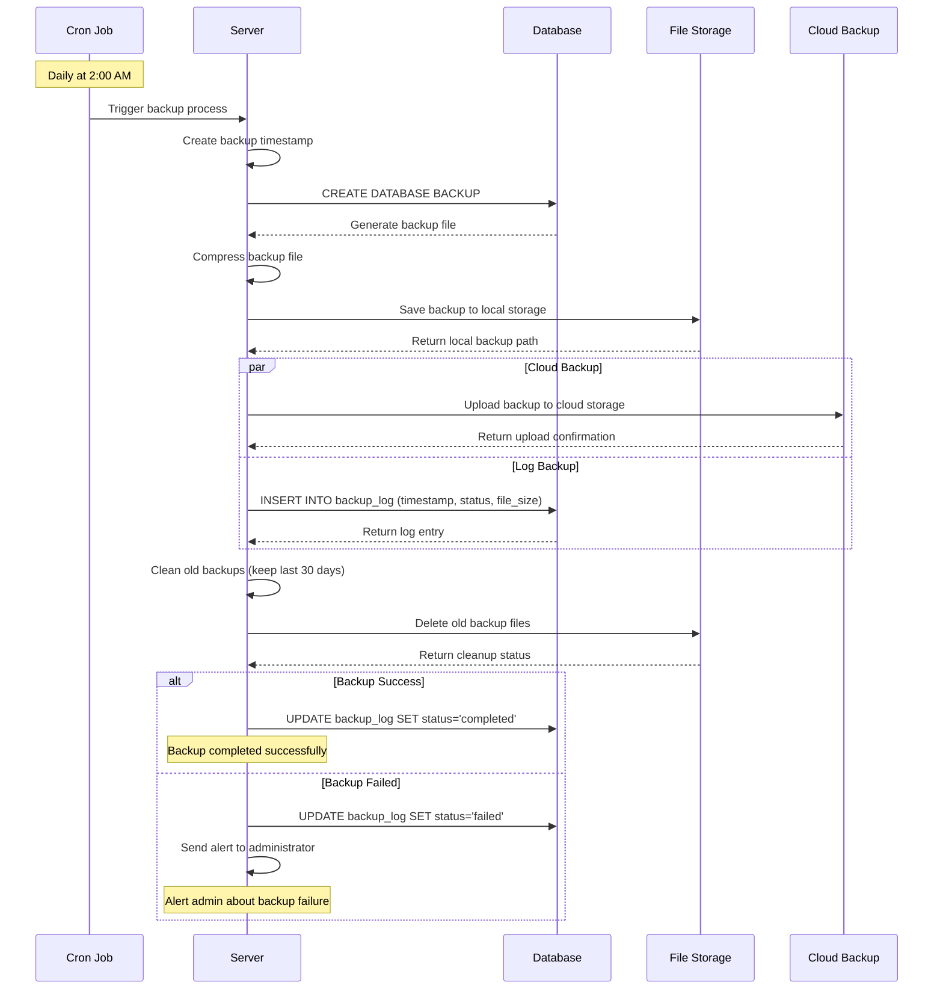
```mermaid
sequenceDiagram
    participant Cron as Cron Job
    participant S as Server
    participant DB as Database
    participant Storage as File Storage
    participant Cloud as Cloud Backup
    
    Note over Cron: Daily at 2:00 AM
    Cron->>S: Trigger backup process
    
    S->>S: Create backup timestamp
    S->>DB: CREATE DATABASE BACKUP
    DB-->>S: Generate backup file
    
    S->>S: Compress backup file
    S->>Storage: Save backup to local storage
    Storage-->>S: Return local backup path
    
    par Cloud Backup
        S->>Cloud: Upload backup to cloud storage
        Cloud-->>S: Return upload confirmation
    and Log Backup
        S->>DB: INSERT INTO backup_log (timestamp, status, file_size)
        DB-->>S: Return log entry
    end
    
    S->>S: Clean old backups (keep last 30 days)
    S->>Storage: Delete old backup files
    Storage-->>S: Return cleanup status
    
    alt Backup Success
        S->>DB: UPDATE backup_log SET status='completed'
        Note over S: Backup completed successfully
    else Backup Failed
        S->>DB: UPDATE backup_log SET status='failed'
        S->>S: Send alert to administrator
        Note over S: Alert admin about backup failure
    end
```

## Key Sequence Diagram Patterns

### Authentication Flow (Used in multiple diagrams)
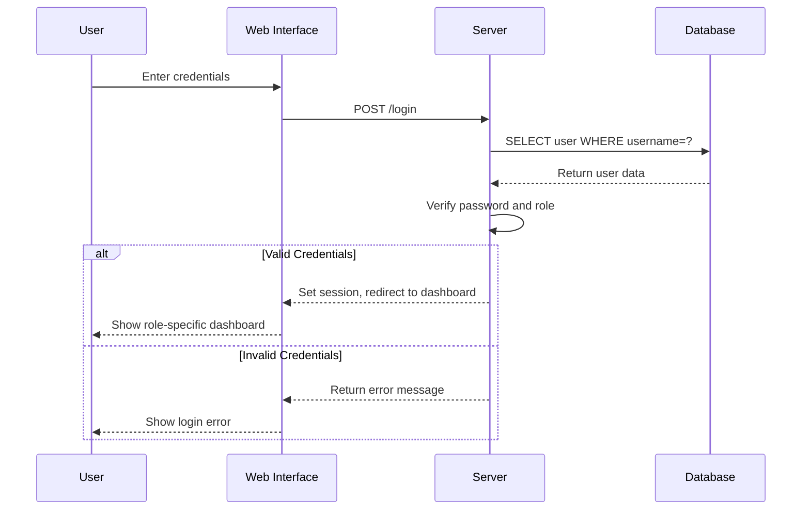
```mermaid
sequenceDiagram
    participant User
    participant UI as Web Interface
    participant S as Server
    participant DB as Database
    
    User->>UI: Enter credentials
    UI->>S: POST /login
    S->>DB: SELECT user WHERE username=?
    DB-->>S: Return user data
    S->>S: Verify password and role
    alt Valid Credentials
        S-->>UI: Set session, redirect to dashboard
        UI-->>User: Show role-specific dashboard
    else Invalid Credentials
        S-->>UI: Return error message
        UI-->>User: Show login error
    end
```

### Data Validation Pattern (Used in multiple diagrams)
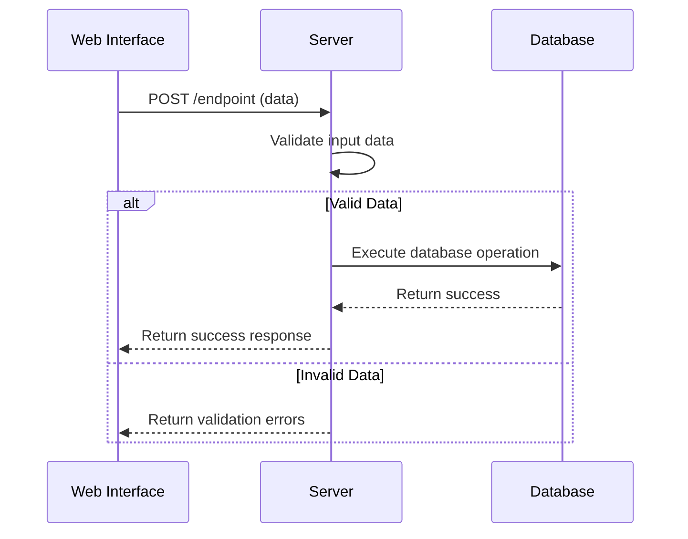
```mermaid
sequenceDiagram
    participant UI as Web Interface
    participant S as Server
    participant DB as Database
    
    UI->>S: POST /endpoint (data)
    S->>S: Validate input data
    alt Valid Data
        S->>DB: Execute database operation
        DB-->>S: Return success
        S-->>UI: Return success response
    else Invalid Data
        S-->>UI: Return validation errors
    end
```

### Error Handling Pattern (Used in multiple diagrams)
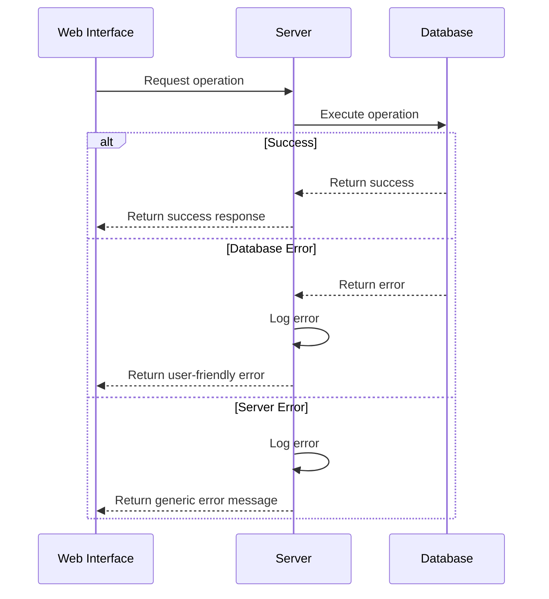
```mermaid
sequenceDiagram
    participant UI as Web Interface
    participant S as Server
    participant DB as Database
    
    UI->>S: Request operation
    S->>DB: Execute operation
    alt Success
        DB-->>S: Return success
        S-->>UI: Return success response
    else Database Error
        DB-->>S: Return error
        S->>S: Log error
        S-->>UI: Return user-friendly error
    else Server Error
        S->>S: Log error
        S-->>UI: Return generic error message
    end
```